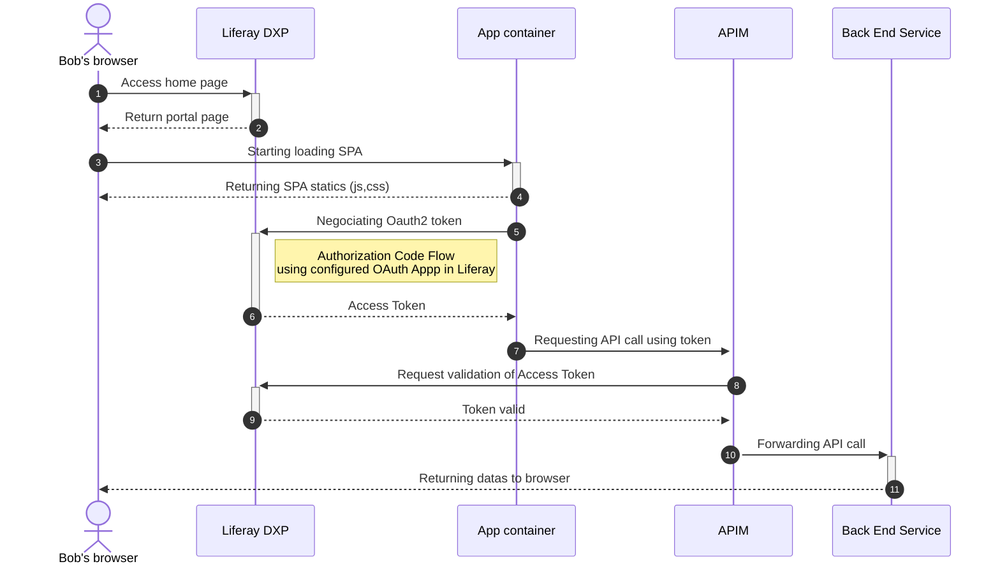

# Solution 03 : APIM validating OAuth token in Liferay

- Web component: utilizes the Liferay object Liferay.OAuth2Client.FromUserAgentApplication(custom scope).
- Liferay OAuth2 client acts as an intermediary.
- More precisely: an external client of type oAuthApplicationUserAgent on the custom scope.
- In the Liferay admin, under Service Access policies, creating OAUTH2_(custom scope) allows creating a scope without additional development.
- The condition is that the API manager validates the token with Liferay, using this scope. This effectively enables "forwarding" to a backend service with a different domain name.
- Note: to achieve this, the token is temporarily stored in session storage.

## Setup

### 1. Configure service access policy to create a new OAuth 2.0 scope

Creation of available scopes remain a manual operation

In Liferay Control Panel, go to Service Access Policy and hit the + button to create a new Service Accee Policy.

For the name: OAUTH2_httpbin.read

The OAUTH2_ prefix is used to register new scopes in Liferay.

Check Enabled

For the title: Make requests against https://httpbin.org/get

Hit Save.

## Utils

### 1. Exposed services

#### 1. APIM

| Service             | Title   | Links |
| --------         | ------- | -------                                                        |
| Cities           | https://apim.dev.local:8443/cities      | Returned the headers of original request has a response |
| Debug            | http://apim.dev.local:8800/debug/get    | Returned all french cities using the public french government API |

#### 2. PORTAL

| Service             | Title   | Links |
| --------         | ------- | -------                                                        |
| Liferay           | https://portal.dev.local:8080      | URL of Liferay portal |

#### 3. APPS

| Service             | Title   | Links |
| --------         | ------- | -------                                                        |
| APP1             | https://app1.dev.local:3000     | URL of first app declared has client extension on Liferay |
| APP2             | https://app2.dev.local:3000     | URL of second app declared has client extension on Liferay |
