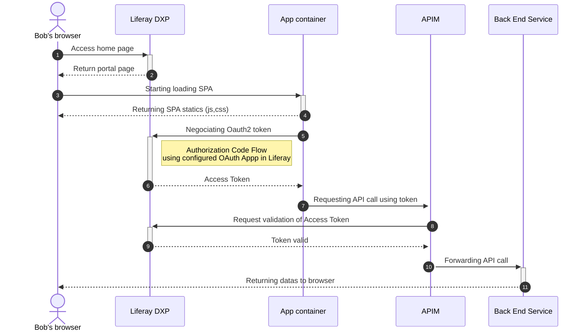

# Solution 03 : APIM validating Oauth token in Liferay

```mermaid
sequenceDiagram
    autonumber
    actor Bob's browser
    Bob's browser->>+Liferay DXP: Access home page
    Liferay DXP-->>-Bob's browser: Return portal page
    Bob's browser->>+App container: Starting loading SPA
    App container-->>-Bob's browser: Returning SPA statics (js,css)
    App container->>+Liferay DXP: Negociating Oauth2 token
    Note right of Liferay DXP: Authorization Code Flow <br/>using configured OAuth Appp in Liferay
    Liferay DXP-->>-App container: Access Token
    App container->>+APIM: Requesting API call using token
    APIM->>+Liferay DXP: Request validation of Access Token
    Liferay DXP-->>-APIM: Token valid
    APIM->>+Back End Service : Forwarding API call
    Back End Service-->>-Bob's browser: Returning datas to browser
```