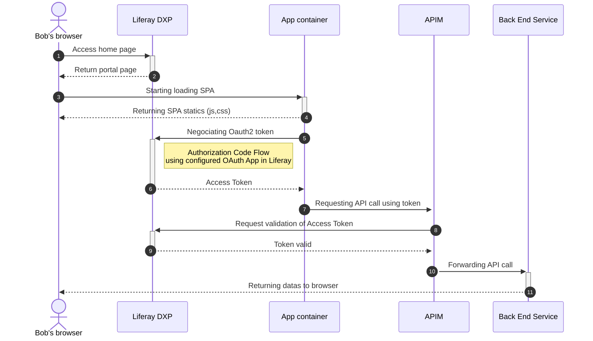

# Scenario 03 : APIM validating OAuth token in Liferay



## IMPORTANT NOTES

In this scenario Liferay is the main authorization servers (tokens are manages by Liferay). Front-end apps run in separate containers. 

* Authorization code flow with PKCE doesn't need a secret to work
* APP2 uses Liferay OOTB client to work that is abble to automatically retrieve clientId from the configuration. No code update is necessary to make app2 work.
* Two apps hosted is separate containers are available in the stack
    * Apps description :
        * App1 : Using Liferays's OOTB client to interact with APIM
        * App2 : Using custom Oauth client implementation to minimize coupling with Liferay
    * The apps doesn't share token. Each apps stores tokens in sessions storage (one different token per app). This configuration allows application to leverage different oAuth configuration and independent scopes for each app.

## Setup

### Configure /etc/hosts
You need to properly configure hostnames to make this setup working as expected
See [/etc/hosts configuration](../README.md)

### Build stack
```shell
$ cd ./runtime-environment
$ ./build.sh
```

### Deploy
```shell
$ cd ./runtime-environment
$ ./deploy.sh
```

### Starting stack
```shell
$ cd ./runtime-environment
$ ./start.sh
```
### Manual actions

#### Configure Virtual instance host

 Using control panel configure company's virtual instance following screenshot below


#### Configure service access policy to create a new OAuth 2.0 scope

Creation of available scopes remain a manual operation

In Liferay Control Panel, go to Service Access Policy and hit the + button to create a new Service Access Policy.

For the name: **OAUTH2_apim.httpbin.mock.read**

The OAUTH2_ prefix is used to register new scopes in Liferay.

Check Enabled

For the title: Make requests against https://httpbin.org/get

Hit Save.

Repeat operation for **OAUTH2_apim.communes.read**

#### Create OAuth Client declaration for each app

Using control panel (be aware of selecting APP1 configuration):

1. Copy clientId


2. Update APP1 
Update Oauth 2.O App1 configuration : 
    a. Edit ./front-end/app1/src/services/ApimClient.js
    b. At the top of the class update json with clientId and secret 

3. reBuild APP1
```shell
$ cd ./runtime-environment
$ ./rebuildApp1.sh
```

####  Pages creation
Create page for app1 :
1. Create page app1
2. Under Remote Apps section drop App1 on the page

Create page for app2 :
1. Create page app2
2. Under Remote Apps section drop App2 on the page

####  Update callback URLs in the two Oauth configurations

1. For APP1 oauth configuration
Update callback URL according to created pages urls :


copy / paste the following in the field visible on screenshot above 

```code
@protocol@://portal.dev.local@port-with-colon@/o/oauth2/redirect
@protocol@://portal.dev.local@port-with-colon@/app1
http://tester.dev.local/authorization_code_pkce?url=@protocol@://portal.dev.local@port-with-colon@&client_id=id-2ede2606-9967-e3af-db74-4d94c68ebd
```

2. For APP2 oauth configuration
Repeat APP1 operation using following URL's instead 

```code
@protocol@://portal.dev.local@port-with-colon@/o/oauth2/redirect
@protocol@://portal.dev.local@port-with-colon@/app1
http://tester.dev.local/authorization_code_pkce?url=@protocol@://portal.dev.local@port-with-colon@&client_id=id-2ede2606-9967-e3af-db74-4d94c68ebd
```

## Utils

### 1. Exposed services

#### 1. APIM

| Service             | Title   | Links |
| --------         | ------- | -------                                                        |
| Cities           | https://apim.dev.local:8443/cities      | Returned the headers of original request has a response |
| Debug            | http://apim.dev.local:8800/debug/get    | Returned all french cities using the public french government API |

#### 2. PORTAL

| Service             | Title   | Links |
| --------         | ------- | -------                                                        |
| Liferay           | https://portal.dev.local:8080      | URL of Liferay portal |


#### 3. APPS


| Service             | Title   | Links |
| --------         | ------- | -------                                                        |
| APP1             | https://app1.dev.local:3000     | URL of first app declared has client extension on Liferay |
| APP2             | https://app2.dev.local:3000     | URL of second app declared has client extension on Liferay |

#### 4. TESTER

| Service             | Title   | Links |
| --------         | ------- | -------                                                        |
| TESTER             | https://tester.dev.local     | Javascript client to test OAuth authorization code flow |

## TODO
- Verifying token in APIM side -> Check that APIM reject calls if no token is passed (the App will not work anymore outside Liferay).
- Managing refresh token

## TO SOLVE
- Automatic deployement ./gradlew deploy
- Update Liferay Virtual Host Value automatically
- Instance settings has client extension doesn't work
- Simulator does not obtain access token using PKCE (Invalid grant)